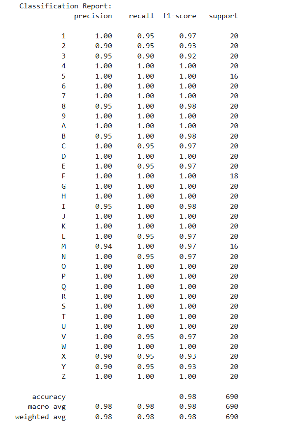
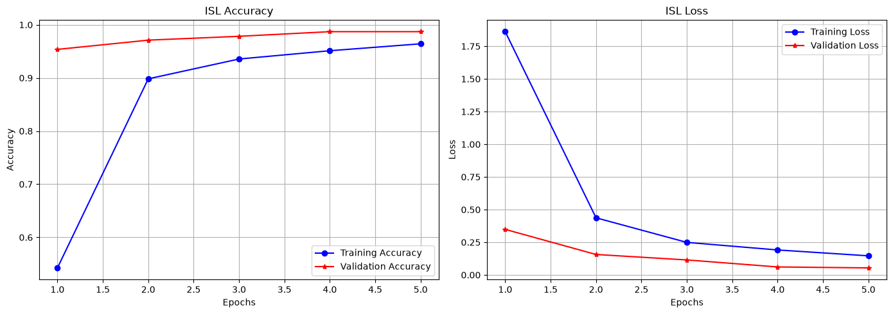
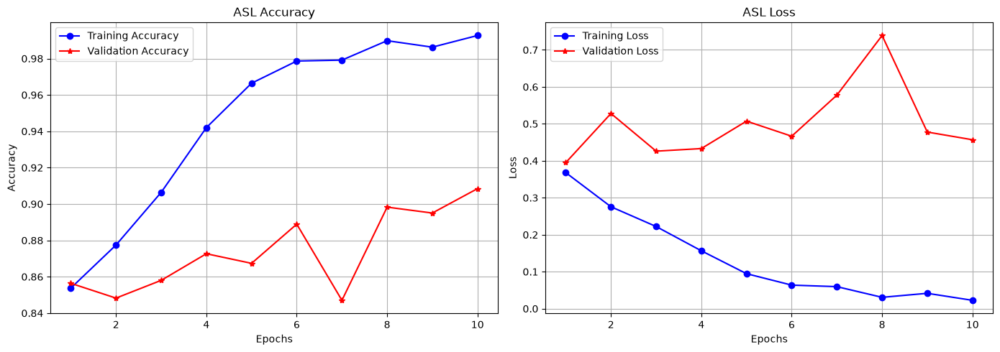

# Sign Language Recognition — ASL & ISL

[](https://www.python.org/)
[](https://www.tensorflow.org/)
[](https://opencv.org/)
[](https://scikit-learn.org/)
[](https://jupyter.org/)
[](https://gtts.readthedocs.io/)

**Module:** ACM40960 — Projects in Maths Modelling, MSc. Data and
Computational Science

**Institution:** University College Dublin

📄 [Project Poster](./Sign-Recognition%20Poster.pdf) · 🔗
[Repository](https://github.com/ACM40960/Sign-Recognition)

------------------------------------------------------------------------

## Table of Contents

-   [Motivation](#motivation)
-   [Objectives](#objectives)
-   [Datasets](#datasets)
-   [Methodology](#methodology)
-   [Sign Recognition Pipeline](#sign-recognition-pipeline)
-   [Results](#results)
-   [Bilingual Output](#bilingual-output-english--telugu)
-   [Repository Structure](#repository-structure)
-   [Installation](#installation)
-   [Usage](#usage)
-   [Limitations](#limitations)
-   [Future Work](#future-work)

------------------------------------------------------------------------

## Motivation

Communication between sign-language users and people unfamiliar with
sign language can be difficult in everyday situations. This project
explores a computer-vision-based approach to recognising static ASL and
ISL hand gestures and converting recognised signs into accessible text
and speech.

## Objectives

-   Recognise ASL and ISL static hand gestures
-   Use deep learning models suited to each dataset
-   Perform prediction using images from the dataset
-   Produce visual sign predictions
-   Provide English and Telugu speech output
-   Evaluate performance using accuracy, precision, recall, F1-score,
    and confusion matrices

## Datasets

### ASL Dataset (American Sign Language)

-   **Source:** [Zenodo](https://zenodo.org/records/14635573)
-   Contains images of ASL alphabet signs
-   Collected from multiple donors
-   Pre-processed and organised by class

### ISL Dataset (Indian Sign Language)

-   **Source:** [Mendeley
    Data](https://data.mendeley.com/datasets/yx7kdssfjp/1)
-   Contains images of ISL alphabet and number signs
-   High-quality dataset captured from multiple signers
-   Organised by class

Duplicate images within each ISL class were filtered out using
perceptual hashing (`imagehash`) prior to training.

## Methodology

Dataset-specific deep learning models are used for sign classification:
a custom CNN for ASL, and a pretrained MobileNetV2 architecture
(transfer learning) for ISL.

### ASL Model — Custom CNN

-   **Input:** 128 × 128 grayscale images
-   **Architecture:**
    -   Conv2D(32, 3×3, ReLU) → MaxPooling(2×2)
    -   Conv2D(64, 3×3, ReLU) → MaxPooling(2×2)
    -   Conv2D(128, 3×3, ReLU) → MaxPooling(2×2)
    -   Conv2D(128, 3×3, ReLU) → MaxPooling(2×2)
    -   Flatten → Dense(512, ReLU) → Dropout(0.5) → Dense(N classes,
        Softmax)
-   **Augmentation:** rotation, zoom, horizontal flip
    (`ImageDataGenerator`)
-   **Optimizer / Loss:** Adam / categorical cross-entropy
-   **Epochs:** 10

### ISL Model — MobileNetV2 (Transfer Learning)

-   **Input:** 64 × 64 RGB images
-   **Architecture:** MobileNetV2 (pretrained on ImageNet, frozen base)
    → GlobalAveragePooling2D → Dense(128, ReLU) → Dropout(0.5) → Dense(N
    classes, Softmax)
-   **Augmentation:** rotation, zoom, width/height shift
    (`ImageDataGenerator`, no horizontal flip)
-   **Optimizer / Loss:** Adam / categorical cross-entropy
-   **Epochs:** 5

## Sign Recognition Pipeline

```         
START → Data Collection → ASL/ISL Model → Prediction + Confidence → English/Telugu Speech
```

The pipeline collects sign images (or a live capture), processes them
through the trained ASL/ISL model, predicts the sign with a confidence
score, and converts the result into English and Telugu speech via
`gTTS`.

## Results

Model performance was evaluated using accuracy, precision, recall,
F1-score, and confusion matrices on held-out validation splits for both
datasets. The ISL confusion matrix shows strong class-wise separation,
with most predictions concentrated along the diagonal and a small number
of misclassifications between visually similar gestures.

### Final Test Accuracy

| Model             | Validation Accuracy |
|-------------------|---------------------|
| ASL — Custom CNN  | **89.14%**          |
| ISL — MobileNetV2 | **98.84%**          |

### ISL Classification Report

The ISL model (35 classes: digits 1–9 and letters A–Z) achieves a
weighted average precision, recall, and F1-score of **0.98** across 690
validation samples, with every class scoring above 0.85 on all three
metrics.



### Training Curves

**ISL (MobileNetV2):** training and validation accuracy converge closely
by epoch 3–5, with validation loss tracking below training loss
throughout — indicating good generalisation and no overfitting.



**ASL (Custom CNN):** training accuracy climbs steadily to \~99%, but
validation accuracy plateaus around 88–91% and validation loss becomes
noisy and trends upward after epoch 3 while training loss keeps falling
— a sign of mild overfitting on the smaller/less varied ASL dataset.
This is a useful discussion point for the report: it explains the
accuracy gap between the two models and motivates future work such as
stronger regularisation, more aggressive augmentation, or early stopping
for the ASL model.




## Bilingual Output (English & Telugu)

Recognised signs are converted into English and Telugu text, enabling
accessible bilingual speech output — e.g. a recognised "A" sign is
displayed as "The predicted sign is A" in English and its Telugu
equivalent, then read aloud via `gTTS`.

- [ISL Sign "8" — Real-Time Prediction](./output/Video%20output%20ISL%20-%208.mp4)

- [ISL Sign "U" — Real-Time Prediction](./output/Video%20output%20ISL%20-%20U.mp4)

## Repository Structure

```         
Sign-Recognition/
├── data/
│   ├── ASL_dataset/            # ASL alphabet images 
│   ├── ISL_dataset/
│   │   └── data/                # ISL alphabet & number images 
│   ├── ASL Signs.jpeg           # ASL sample/reference sheet
│   └── ISL Signs.jpeg           # ISL sample/reference sheet
├── output/                      # Trained models, plots, evaluation outputs
├── source-code/                 # Notebook(s) 
├── assets/                      # README images (results, training curves)
├── README.md
├── Sign-Recognition Poster.pdf
└── labels.txt
└── requirements.txt
```

## Installation

**Requirements:** Python 3.x, Jupyter Notebook

``` bash
git clone https://github.com/ACM40960/Sign-Recognition.git
cd Sign-Recognition
python -m venv venv
venv\Scripts\activate
pip install -r requirements.txt
pip install ipykernel
python -m ipykernel install --user --name=venv --display-name "Python (Sign-Recognition)"
jupyter notebook
```

Or install dependencies individually as used in the notebook:

``` bash
pip install pandas imagehash gTTS playsound pyttsx3 tensorflow opencv-python pillow seaborn scikit-learn matplotlib ipywidgets
```

Download the datasets and place them under `data/`: - ASL:
[zenodo.org/records/14635573](https://zenodo.org/records/14635573) →
`data/ASL_dataset/` - ISL:
[data.mendeley.com/datasets/yx7kdssfjp/1](https://data.mendeley.com/datasets/yx7kdssfjp/1)
→ `data/ISL_dataset/data/`

## Usage

1.  Open the notebook in `source-code/` in Jupyter Notebook / JupyterLab
2.  Run the setup cells to load the datasets from `data/ASL_dataset` and
    `data/ISL_dataset/data`
3.  Run the training cells to train the ASL (Custom CNN) and ISL
    (MobileNetV2) models — trained models and evaluation artefacts are
    written to `output/`
4.  Run the evaluation cells to reproduce the accuracy metrics and
    confusion matrices
5.  Run the inference/UI cells to capture or select an image, predict
    the sign, and hear the English/Telugu speech output

## Limitations

-   Current system recognises static gestures only
-   Performance affected by lighting, background, and hand orientation
-   Limited gesture vocabulary bounded by dataset size
-   Continuous sign language recognition (words/sentences) not supported

## Future Work

-   Continuous sign recognition
-   Expand vocabulary to words and sentences
-   Improve robustness across environments
-   Incorporate facial expressions and posture
-   Optimise for mobile and edge deployment

## Authors

### Charvik Reddy Kodumur

Student ID: 25204083

### Manoj Srivathsava Mokshagundam

Student ID: 25201689
